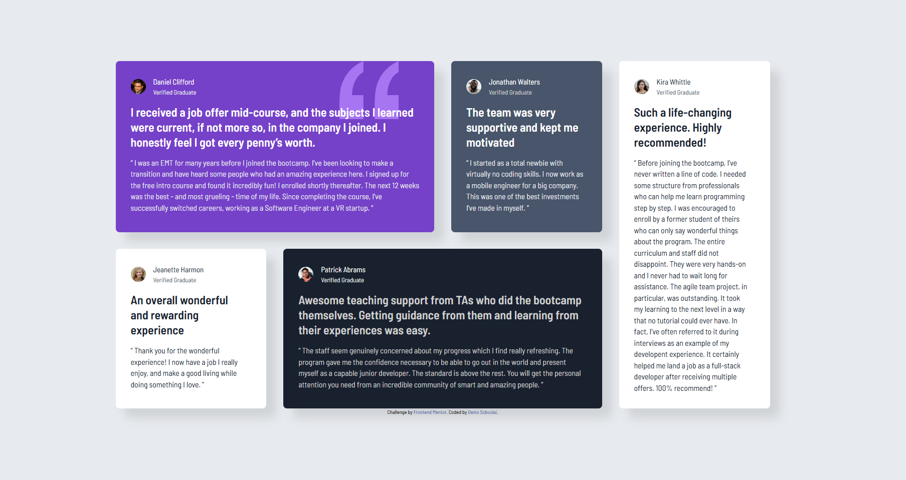

# Frontend Mentor - Testimonials grid section solution

This is a solution to the [Testimonials grid section challenge on Frontend Mentor](https://www.frontendmentor.io/challenges/testimonials-grid-section-Nnw6J7Un7). Frontend Mentor challenges help you improve your coding skills by building realistic projects.

## Table of contents

- [Overview](#overview)
  - [The challenge](#the-challenge)
  - [Screenshot](#screenshot)
  - [Links](#links)
- [My process](#my-process)
  - [Built with](#built-with)
  - [What I learned](#what-i-learned)
  - [Continued development](#continued-development)
  - [Useful resources](#useful-resources)
- [Author](#author)

## Overview

### The challenge

Users should be able to:

- View the optimal layout for the site depending on their device's screen size

### Screenshot



### Links

- Solution URL: [Add solution URL here](https://github.com/denissoboslai13/frontend-mentor-testimonials-grid/blob/main/index.html)
- Live Site URL: [Add live site URL here](https://denissoboslai13.github.io/frontend-mentor-testimonials-grid/)

## My process

### Built with

- Semantic HTML5 markup
- CSS custom properties
- Flexbox
- CSS Grid
- Mobile-first workflow
- Tailwind CSS

### What I learned

I learned how to properly work with grid and flexbox in conjunction, and i think i did pretty well. I also learned how to properly define column and row sizes in grids, so it doesnt look lobsided.

To see how you can add code snippets, see below:

```html
<div
  class="flex flex-col gap-9 lg:grid lg:grid-rows-[auto_auto] lg:grid-cols-4"
></div>
```

### Continued development

I think these two things are the backbones of modern responsive web design, so ill probably be using them for basically every project i do, which is a good thing since i need to still learn the more thoroughly.

### Useful resources

- [Tailwind Docs](https://tailwindcss.com/) - Still just tailwind docs, was helpful when i didnt know how to properly define row and column sizes.

## Author

- Frontend Mentor - [@denissoboslai13](https://www.frontendmentor.io/profile/denissoboslai13)
